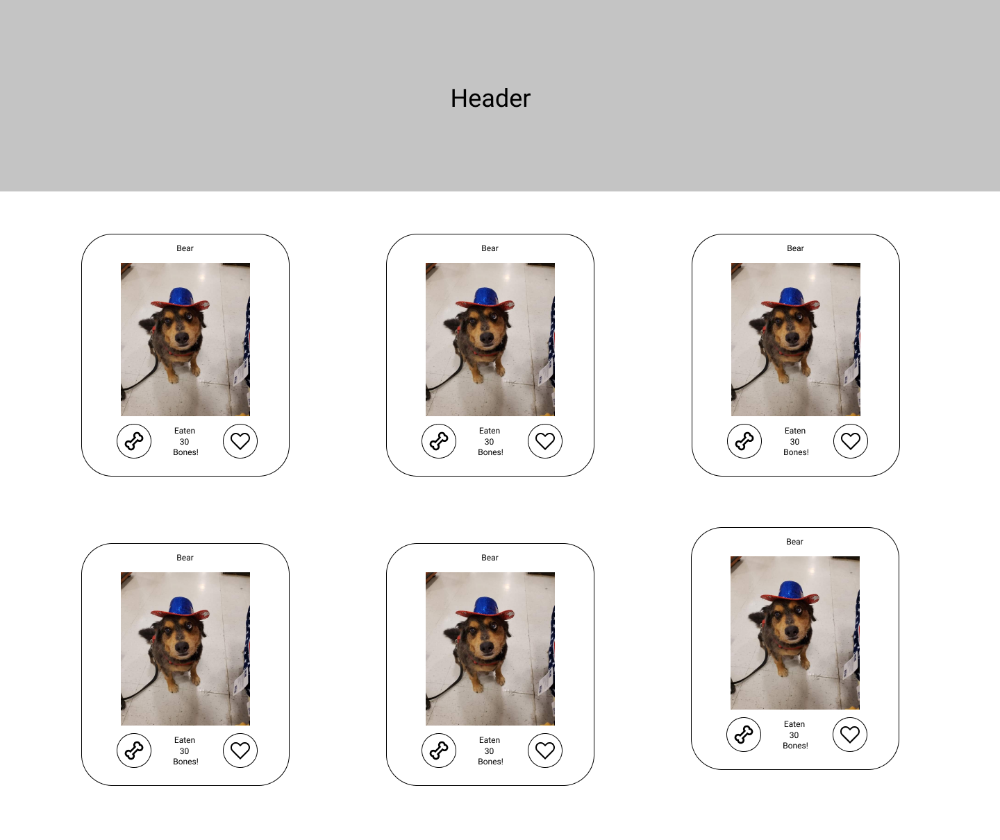
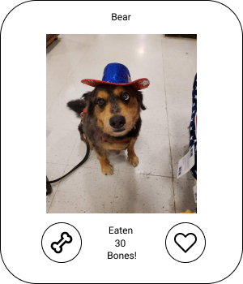

# Learning React by Example

Welcome to my (hopefully) helpful teaching tool for taking your very first steps toward making an app in React!  This project was made in early March of 2022, so please be aware that depending on how long it's been since then, React has likely changed!  Time erodes even the greatest structures, and JS libraries are no exception.  If you find this guide to be brokenly out of date, please file an issue so I can adjust things!

## Is This Tool For Me?

If you have:

- An interest in learning React
- Some experience with JavaScript
- Experience with HTML/CSS
- Some experience with Git is a plus

If you want:

- To learn by doing
- Clearly marked challenges
- To have a tangible app to take home

This tool is likely for you!  React is fun, but there's a bit of a learning curve, as with all libraries and frameworks.  I've done the best I can to assume very little knowledge of React and JS concepts, so this is a good project for a newcomer.  Feel free to Google around if you don't understand something or want to learn more about how React works.  I wanted to keep the comments limited to instructions for the project, so reading up on the React documentation is always a good idea!  You might even learn something that I don't know about yet.  However, I have included some recommended readings that pertain to each challenge.

## Requirements

- `npm` version 16.0.0 and up
- Powershell 7 and up if you're on Windows

It is recommended that you use [Node Version Manager](https://github.com/nvm-sh/nvm) to install `Node.js` and `npm`. Much easier to switch versions, install, the works.

## Recommended Tools

- A text editor or IDE, such as Visual Studio Code
- `nvm`
- Patience, determination, and coffee

## Setup Instructions

1. Clone this project down to your local machine using Git
    - `git clone git@github.com:kmausolf/learning-react.git`
    - You can also fork this repository if you'd like to save your progress on your own version of the repo
    - Alternatively, you can download the project code as a zip file.  Go to the releases section of this repo and download the newest release.
2. Open your terminal and `cd` to this project's directory.
3. Run `npm install`

## Project Overview

Our project theme is the appreciation of good dogs, so we're going to create a small museum app to celebrate their gifts and talents.  Our Museum component uses information in a JSON object, `dogs`, to dynamically generate DogCard components that contain all of the information about each dog and ways to interact with each individual dog.  We'll also add a header to our app that sits above the museum of dogs that shows the name of your museum (you pick!).

The goal of this project is to create your first app by completing the code challenges within.  Most code challenges have a nearby example for you to base your solution off of.  That's the "by example" part!  Of course, there are challenges in this project that are designed to leverage your creativity, mainly in the styling and layout department.  The app contains only very basic CSS, and you will need to create your own styles and CSS classes to have the components match the design.

The app can be considered "done" when:
- All marked challenges have been completed
- The app has been styled to match the design layout
    - It doesn't have to be exact, but something close to that.  You're welcome to style the components how you wish.  Be creative!

For instructions on how to run the project, please see the React App documentation below.

## Designs

I've included some design targets for the project.  Try to style your app such that it is close to the given layout and card style.  As previously mentioned, feel free to be creative in styling your app!  Side note, that's Bear, my parents dog.  He was the bestest boy, so I've included him in the designs as an image placeholder.

### Main Layout



### DogCard Design



## Project Roadmap

I've marked each challenge with a number indicating the recommended order of each challenge.  Details on each challenge will be provided below.  As a side note, if you see a pair of curly braces like so:

```
{// this block is safe to remove
 /* some text here */
}
```
It's safe to remove from the opening curly brace to the ending curly brace.  Sorry if this is a bit confusing, but it's the only way to add comments within the markup (tree of components and HTML elements).

### Challenge #1

Our first challenge is going to be getting something to show up on the screen, even if it doesn't look pretty.  It's easier to fiddle with styling on a component if you can see it, right?  Turn your attention to the `Museum.js` file.  There's one challenge in `Museum.js`, but it's arguably the hardest if you're unfamiliar with JS.

`map` is a JavaScript function that can be invoked on iterable data structures, such as arrays.  You'll be working with an array called `dogs`.  I've imported it for you.  We can invoke `map` on `dogs`, because `dogs` is one such iterable data structure.  `map` takes one argument, the function that should be invoked on each item in the array. The function you provide to `map` should also take one argument.  Naming this argument `dog` would be a descriptive name, because each time the function is called, `map` gives the function one item from the array -- that is to say, one `dog`.  The function should return one React component each time it is executed by `map`.  `map` returns to you an array containing the result of each time the function you provided was called.  If you had your function return a React component each time, `map`'s result will be an array of React components (in your case, DogCard components specifically).  Return this array of components from the `generateDogCards()` function, and you should see the results on the screen.

This is the first time we've passed props to a component in React.  What are props?  In short, they're values you can pass down to your components.  If you pass DogCard a `dog` prop in `Museum.js`, that object will be accessible from the DogCard component.  For an example of passing props, take a look toward the bottom of DogCard, where I pass the CardButton component various props.

VERY IMPORTANT: When we create components via a function like `map`, we say that they are dynamically generated.  As such, they require a key.  Be sure to assign every HTML element/component you generate from a map function a uniqe `key` prop.  React needs this to be able to detect which components need to update.  Assign `dog.id` to the `key` prop.

### Recommended Readings

- [Components and Props](https://reactjs.org/docs/components-and-props.html)
- [Map function](https://developer.mozilla.org/en-US/docs/Web/JavaScript/Reference/Global_Objects/Array/map)
- [React Lists and Keys](https://reactjs.org/docs/lists-and-keys.html)

## Challenge #2

First off, great job on completing Challenge 1.  We do a lot of dynamic rendering in libraries and frameworks such as React, and knowing how to dynamically render components is crucial.

The next challenge is going to be getting the image of the dog to show up on screen.  This one should feel pretty familiar if you have experience with HTML and CSS, which you should before attempting this project.  We can use an `` tag for this element.  For the `` tag's `src` property, use `dog.image`.  You'll need to style this element yourself so that it is similar to the design.

### Recommended Readings

- [HTML img tag](https://www.w3schools.com/tags/tag_img.asp)
- [Flexbox in CSS](https://css-tricks.com/snippets/css/a-guide-to-flexbox/)

## Challenge 3

This challenge will be our first time using state in a functional component.  React provides us a hook called `useState`.  Whatever value you pass into `useState()` will be the initial value.  For example, if I do `const [isSkyBlue, setIsSkyBlue] = useState(true);`, the initial value of `isSkyBlue` is true.  We can change the value by calling `setIsSkyBlue()` and passing the new value as its argument.  Your goal here is to set up a state hook that we can use to keep track of how many bones each dog has eaten.  Since each dog has assumedly eaten no bones prior to arriving at the museum, the initial value should be 0.

### Recommended Readings

- [Intro to React Hooks](https://reactjs.org/docs/hooks-intro.html)
- [Using the State Hook](https://reactjs.org/docs/hooks-state.html)
- [Lifecycle Methods in Functional Components - useEffect](https://reactjs.org/docs/hooks-effect.html)

## Challenge 4

For this challenge, all you need to do is show the number of bones consumed by the dog.  You can display JS values in the HTML markup here (yay for JSX!) by placing them between a set of curly braces like this: `<div>{myValue}</div>`.  Once you've added that value in, you'll see it displayed on the DogCard.  We don't have a button we can use to change the value just yet though.

### Recommended Readings

- [Intro to JSX](https://reactjs.org/docs/introducing-jsx.html)

## Challenge 5

In this challenge, we'll be using the state value and setter function we got from the hook we set up in Challenge 3.  Create a function that, when called, increases the number of bones the dog has consumed by 1.  You will need to use both the current state value and the setter function to complete this challenge.

When we provide a function to an element's `onClick` property, that element will provide us a prop called `event`.  Here, we're ignoring it, because the only thing we care about is whether the button was clicked or not.  Many "action" properties such as `onKeyDown`, `onClick`, and `onKeyPress` will pass you an `event` parameter.  In the case of `onKeyPress`, the event parameter will contain information about what key was pressed.

### Recommended Readings

- [Handling Events In React](https://reactjs.org/docs/handling-events.html)

## Challenge 6

Just like in `Museum.js`, it's time to pass props again, but this time to CardButton.  For a description of CardButton's props, take a look at the comments at the top of `CardButton.js`.  Since CardButton is a reusable component, we might not use every prop that is available on the component.  As mentioned in the comment for this challenge, there's no need to pass the `isActive` prop for this button, I've set it to default to false.  The colors also have default values.  That said, the only prop you really need to pass is the function you created to increase bones consumed to the `buttonAction` prop and `Bone` to `ButtonSvg`.  Feel free to customize the colors by passing string values such as `green` or `#FFFFFF` to the appropriate color props.

You will need to style the buttons yourself to have them be similar to the design.

### Recommended Readings

- [Ternary Operator](https://developer.mozilla.org/en-US/docs/Web/JavaScript/Reference/Operators/Conditional_Operator)
- [Reusable Components](https://blog.logrocket.com/building-reusable-ui-components-with-react-hooks/)

## Challenge 7

Ah, the home stretch!  This is more or less your victory lap.  For this challenge, create your own header for the app.  I've provided the file `Header.js` that you can modify to have the header be whatever you want.  Use good judgement when choosing a height for the banner, as we don't want it to be too big or too small.  Look to popular sites on the web for examples!

Once you've completed your header and styled the app to your liking, you're done!  Congratulations on taking your first steps in React!

## Solutions

My apprentice Danny Sanchez has been so kind as to provide solutions to each challenge!  If you're really, really stuck, feel free to take a peek at how Danny went about solving these!  Big props to @dannysanchez559 on GitHub!

# React App Documentation

I've decided to preserve the Create React App documentation here in case you'd like information about how to run the app (sounds useful, right?).

## Getting Started with Create React App

This project was bootstrapped with [Create React App](https://github.com/facebook/create-react-app).

### Available Scripts

In the project directory, you can run:

#### `npm start`

Runs the app in the development mode.\
Open [http://localhost:3000](http://localhost:3000) to view it in your browser.

The page will reload when you make changes.\
You may also see any lint errors in the console.

#### `npm test`

Launches the test runner in the interactive watch mode.\
See the section about [running tests](https://facebook.github.io/create-react-app/docs/running-tests) for more information.

#### `npm run build`

Builds the app for production to the `build` folder.\
It correctly bundles React in production mode and optimizes the build for the best performance.

The build is minified and the filenames include the hashes.\
Your app is ready to be deployed!

See the section about [deployment](https://facebook.github.io/create-react-app/docs/deployment) for more information.

#### `npm run eject`

**Note: this is a one-way operation. Once you `eject`, you can't go back!**

If you aren't satisfied with the build tool and configuration choices, you can `eject` at any time. This command will remove the single build dependency from your project.

Instead, it will copy all the configuration files and the transitive dependencies (webpack, Babel, ESLint, etc) right into your project so you have full control over them. All of the commands except `eject` will still work, but they will point to the copied scripts so you can tweak them. At this point you're on your own.

You don't have to ever use `eject`. The curated feature set is suitable for small and middle deployments, and you shouldn't feel obligated to use this feature. However we understand that this tool wouldn't be useful if you couldn't customize it when you are ready for it.

### Learn More

You can learn more in the [Create React App documentation](https://facebook.github.io/create-react-app/docs/getting-started).

To learn React, check out the [React documentation](https://reactjs.org/).

#### Code Splitting

This section has moved here: [https://facebook.github.io/create-react-app/docs/code-splitting](https://facebook.github.io/create-react-app/docs/code-splitting)

#### Analyzing the Bundle Size

This section has moved here: [https://facebook.github.io/create-react-app/docs/analyzing-the-bundle-size](https://facebook.github.io/create-react-app/docs/analyzing-the-bundle-size)

#### Making a Progressive Web App

This section has moved here: [https://facebook.github.io/create-react-app/docs/making-a-progressive-web-app](https://facebook.github.io/create-react-app/docs/making-a-progressive-web-app)

#### Advanced Configuration

This section has moved here: [https://facebook.github.io/create-react-app/docs/advanced-configuration](https://facebook.github.io/create-react-app/docs/advanced-configuration)

#### Deployment

This section has moved here: [https://facebook.github.io/create-react-app/docs/deployment](https://facebook.github.io/create-react-app/docs/deployment)

#### `npm run build` fails to minify

This section has moved here: [https://facebook.github.io/create-react-app/docs/troubleshooting#npm-run-build-fails-to-minify](https://facebook.github.io/create-react-app/docs/troubleshooting#npm-run-build-fails-to-minify)
